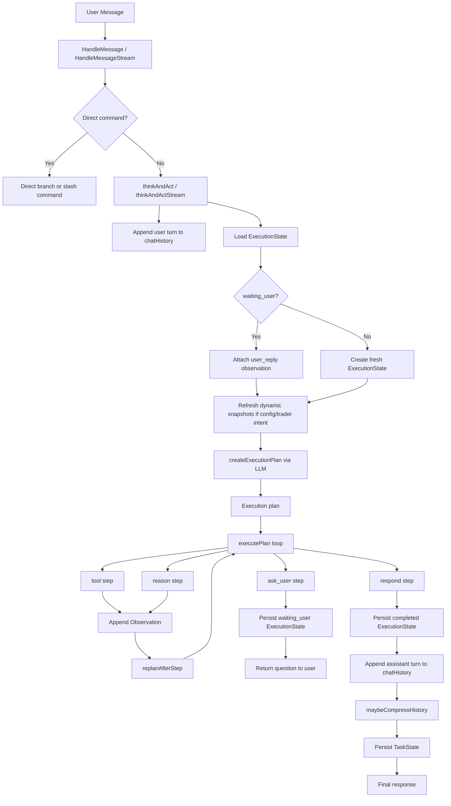
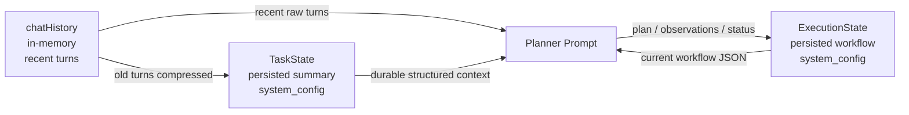
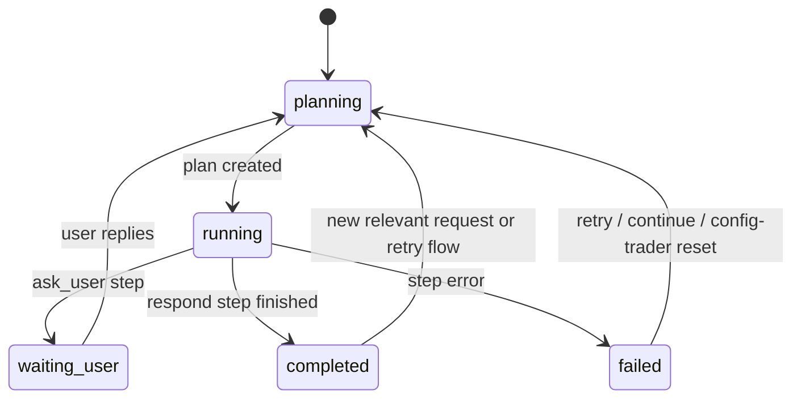

# NOFXi Agent Memory And Planning Design

## Purpose

This document explains how the current NOFXi agent handles:

- short-term conversation memory
- durable task memory
- durable execution / planning state
- planner execution and replanning
- state reset and resume behavior

The implementation described here is primarily in:

- `agent/history.go`
- `agent/memory.go`
- `agent/execution_state.go`
- `agent/planner_runtime.go`
- `agent/agent.go`

## High-Level Model

The current agent uses three different layers of state:

1. `chatHistory`
Recent in-memory user/assistant turns for the live conversation.

2. `TaskState`
Durable summarized context that should survive beyond recent turns.

3. `ExecutionState`
Durable workflow state for the currently running or recently blocked plan.

These three layers serve different purposes and should not be treated as the same thing.

## State Layers

### 1. `chatHistory`

Defined in `agent/history.go`.

Role:

- stores recent `user` / `assistant` messages in memory
- keyed by `userID`
- used as short-term conversational context
- acts as the source material for later compression into `TaskState`

Characteristics:

- in-memory only
- capped by `maxTurns`
- cleared by `/clear`
- not suitable as durable truth

Typical contents:

- the last few user questions
- the last few assistant replies
- temporary conversational wording

### 2. `TaskState`

Defined in `agent/memory.go`.

Role:

- stores durable, structured, non-derivable context
- persisted through `system_config`
- injected into planning and reasoning prompts

Storage key:

- `agent_task_state_<userID>`

Fields:

- `CurrentGoal`
- `ActiveFlow`
- `OpenLoops`
- `ImportantFacts`
- `LastDecision`
- `UpdatedAt`

Intended contents:

- user goal that still matters across turns
- high-level unresolved issues that still matter across turns
- facts that tools cannot cheaply re-fetch
- latest important decision summary

Explicitly not intended for:

- step-level pending items such as "wait for API key"
- execution actions such as "call get_exchange_configs"
- live balances
- current positions
- current market prices
- mutable configuration availability

Those should be checked from tools at planning time instead of being trusted from old summaries.

### 3. `ExecutionState`

Defined in `agent/execution_state.go`.

Role:

- stores the current execution workflow
- allows the agent to resume after `ask_user`
- persists plan steps, observations, and completion status

Storage key:

- `agent_execution_state_<userID>`

Fields:

- `SessionID`
- `UserID`
- `Goal`
- `Status`
- `PlanID`
- `Steps`
- `CurrentStepID`
- `Observations`
- `FinalAnswer`
- `LastError`
- `UpdatedAt`

This is the planner's working state, not a general memory store.

## Data Flow

### Request Entry

Entry points:

- `HandleMessage(...)`
- `HandleMessageStream(...)`

Flow:

1. user message enters `agent`
2. slash commands and explicit direct branches are handled first
3. all other requests go into planner flow via `thinkAndAct(...)` / `thinkAndActStream(...)`

### Planner Flow

The planner pipeline in `agent/planner_runtime.go` is:

1. append user message into `chatHistory`
2. emit `planning` SSE event
3. load `ExecutionState`
4. optionally reset stale `ExecutionState`
5. optionally refresh dynamic configuration snapshots
6. create a fresh execution plan with the LLM
7. execute steps one by one
8. persist `ExecutionState` after important transitions
9. append assistant answer into `chatHistory`
10. maybe compress old conversation into `TaskState`

## Short-Term vs Durable Memory

### What lives in `chatHistory`

Good fits:

- raw recent messages
- conversational wording
- latest assistant phrasing

Bad fits:

- long-lived truths
- current external system state

### What lives in `TaskState`

Good fits:

- durable goal
- high-level unfinished work that remains relevant across turns
- important facts the user stated
- previous decisions and why they were made

Bad fits:

- pending steps inside the current plan
- execution-level reminders such as "wait for a field" or "call a tool"
- old conclusions about whether tools exist
- old conclusions about whether model/exchange config is present
- live operational state that can change outside the chat

### What lives in `ExecutionState`

Good fits:

- current plan steps
- observations from tool calls
- blocked-on-user-input status
- exact current workflow state
- step-level pending work and block reasons

Bad fits:

- evergreen user profile
- long-term semantic memory

## Planning Logic

### Plan Creation

`createExecutionPlan(...)` sends the following into the planner model:

- available tool definitions
- persistent preferences
- `TaskState` context
- `ExecutionState` JSON
- current user request

The planner must return JSON only with step types:

- `tool`
- `reason`
- `ask_user`
- `respond`

### Step Execution

`executePlan(...)` executes the plan loop:

- `tool`
  call tool and append observation
- `reason`
  run reasoning sub-call and append observation
- `ask_user`
  save `waiting_user` state and return question
- `respond`
  generate final answer and mark completed

After each completed step, `replanAfterStep(...)` may:

- continue
- replace remaining steps
- ask user
- finish

## Resume Behavior

When `ExecutionState.Status == waiting_user`, the next user turn is treated as a reply to the pending question.

Current safeguards:

- latest asked question is extracted from the stored plan
- the user reply is appended as a `user_reply` observation
- planner prompt receives explicit `Resume context`

This prevents short replies like `是` from being misread as unrelated fresh intents as often as before.

## Dynamic State Refresh

Configuration and trader management requests are dynamic by nature. Their truth can change outside the current chat, for example:

- user configures exchange in the UI
- user adds model in another tab
- user creates trader elsewhere

Because of that, configuration/trader requests should not trust stale model conclusions.

Current protection in `planner_runtime.go`:

- detects config / trader intent with `isConfigOrTraderIntent(...)`
- clears `TaskState` context from the planner prompt for these requests
- refreshes `ExecutionState.Observations` with fresh snapshots from:
  - `toolGetModelConfigs(...)`
  - `toolGetExchangeConfigs(...)`
  - `toolListTraders(...)`

This makes the planner rely more on current system state and less on older narrative memory.

## Reset Strategy

The system currently resets or weakens stale execution state when:

- user says retry-like phrases such as `再试`, `继续`, `try again`, `continue`
- request is config / trader related and old execution state is failed / completed / waiting

Reset scope:

- `ExecutionState` may be cleared
- `TaskState` is not globally deleted, but it is intentionally ignored for config/trader planning

Manual reset:

- `/clear`

This clears:

- short-term chat history
- task state
- execution state

## Compression Design

`maybeCompressHistory(...)` moves older short-term chat content into `TaskState` when:

- recent message count exceeds the configured window
- estimated token count exceeds the threshold

Compression strategy:

1. keep recent conversation in `chatHistory`
2. summarize older turns into structured `TaskState`
3. persist new `TaskState`
4. replace `chatHistory` with recent slice

Important design rule:

- `TaskState` should keep durable context only
- it should not become a stale copy of mutable operational state

## Current Architecture Diagram

## Memory Relationship Diagram

## State Transition Diagram

## Known Design Tradeoffs

### Strengths

- separates short-term chat from durable task summary
- allows blocked flows to resume
- supports replanning after every meaningful step
- can recover from stale assumptions better for dynamic config/trader requests

### Weaknesses

- `TaskState` is still summary-driven, so summarization quality matters
- planner still depends on model compliance for some transitions
- `ExecutionState` is single-track per user, not multiple concurrent workflows
- config/trader intent detection is heuristic and keyword-based

## Practical Guidance

### When to trust `TaskState`

Trust it for:

- user intent continuity
- open loops
- durable facts

Do not trust it for:

- whether current exchange/model/trader config exists now
- whether a specific operational action is currently possible

### When to trust `ExecutionState`

Trust it for:

- current plan continuity
- exact blocked step
- latest observation chain

Do not trust it blindly when:

- user has changed configuration outside the chat
- the system capabilities changed after deployment

### When to fetch live state again

Always prefer fresh tool snapshots before answering about:

- existing model configs
- existing exchange configs
- existing traders
- whether trader creation can proceed

## Suggested Future Improvements

- add workflow versioning so capability changes invalidate stale `ExecutionState`
- separate `waiting_user_confirmation` from generic `waiting_user`
- introduce code-level handling for short confirmations such as `是`, `好`, `继续`
- move dynamic state refresh from heuristic to explicit planner preflight stage
- support multiple concurrent execution sessions per user if needed
