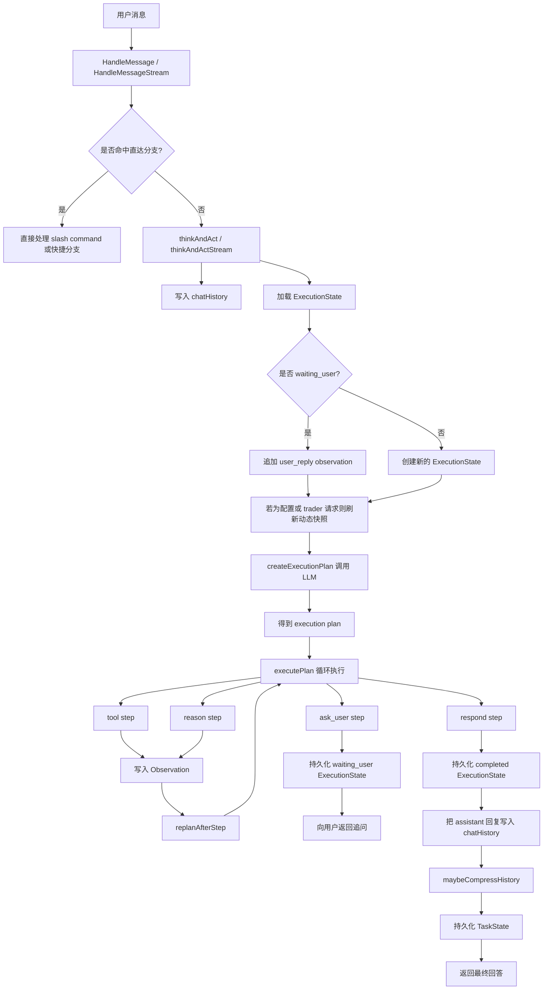
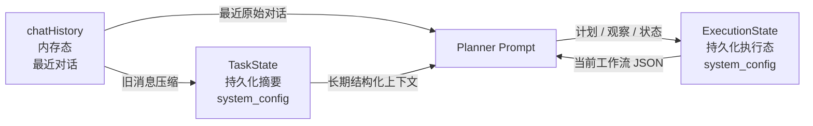
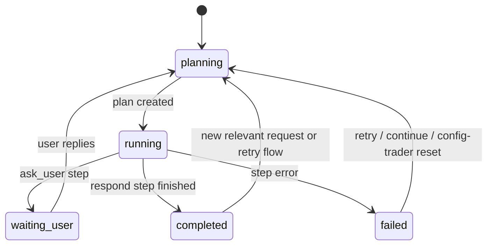

# NOFXi Agent 记忆与规划设计

## 目的

本文说明当前 NOFXi agent 是如何处理以下能力的：

- 短期对话记忆
- 持久化任务记忆
- 持久化执行态 / 规划态
- planner 的执行与重规划
- 状态重置与恢复

本文主要对应以下实现文件：

- `agent/history.go`
- `agent/memory.go`
- `agent/execution_state.go`
- `agent/planner_runtime.go`
- `agent/agent.go`

## 总体模型

当前 agent 使用三层不同的状态：

1. `chatHistory`
用于保存当前会话最近几轮的原始用户/助手对话，驻留内存。

2. `TaskState`
用于保存跨轮次仍然有价值的结构化摘要，持久化存储。

3. `ExecutionState`
用于保存当前规划流程的执行态，支持流程中断后的继续执行。

这三层职责不同，不能混为一谈。

## 三层状态

### 1. `chatHistory`

定义位置：`agent/history.go`

作用：

- 按 `userID` 保存最近的 `user` / `assistant` 消息
- 作为短期对话上下文
- 作为后续压缩进 `TaskState` 的原始素材

特性：

- 仅在内存中存在
- 有 `maxTurns` 上限
- `/clear` 时会清空
- 不适合作为长期真相来源

典型内容：

- 最近几轮用户问题
- 最近几轮助手回答
- 临时措辞与上下文表达

### 2. `TaskState`

定义位置：`agent/memory.go`

作用：

- 保存持久化、结构化、不可轻易从工具重新推导出的上下文
- 通过 `system_config` 持久化
- 注入到 planner / reasoning prompt 中

存储 key：

- `agent_task_state_<userID>`

字段：

- `CurrentGoal`
- `ActiveFlow`
- `OpenLoops`
- `ImportantFacts`
- `LastDecision`
- `UpdatedAt`

适合存放：

- 当前仍有效的用户目标
- 跨轮次仍然成立的高层未闭环问题
- 无法简单通过工具重新读取的重要事实
- 最近一次关键决策及原因

不适合存放：

- “等用户提供 API Key” 这类 step 级待办
- “调用 get_exchange_configs” 这类执行动作
- 实时余额
- 当前持仓
- 当前行情价格
- 是否存在某个配置这类会变化的状态

这些动态信息应该在规划阶段通过工具重新检查，而不是相信旧摘要。

### 3. `ExecutionState`

定义位置：`agent/execution_state.go`

作用：

- 保存当前执行中的工作流状态
- 支持 `ask_user` 之后恢复执行
- 持久化保存计划步骤、观察结果和最终状态

存储 key：

- `agent_execution_state_<userID>`

字段：

- `SessionID`
- `UserID`
- `Goal`
- `Status`
- `PlanID`
- `Steps`
- `CurrentStepID`
- `Observations`
- `FinalAnswer`
- `LastError`
- `UpdatedAt`

它是 planner 的“工作态”，不是通用记忆仓库。

## 数据流

### 请求入口

入口函数：

- `HandleMessage(...)`
- `HandleMessageStream(...)`

流程：

1. 用户消息进入 `agent`
2. 优先处理 slash command 和显式直达分支
3. 其余请求进入 planner 流程：`thinkAndAct(...)` / `thinkAndActStream(...)`

### Planner 主流程

`agent/planner_runtime.go` 中的 planner 管线如下：

1. 把用户消息加入 `chatHistory`
2. 发出 `planning` SSE 事件
3. 加载 `ExecutionState`
4. 视情况重置过期的 `ExecutionState`
5. 视情况刷新动态配置快照
6. 调用 LLM 生成新的执行计划
7. 按步骤执行计划
8. 在关键状态变化后持久化 `ExecutionState`
9. 把助手回答加入 `chatHistory`
10. 视情况把旧对话压缩进 `TaskState`

## 短期记忆 vs 持久记忆

### `chatHistory` 里应该放什么

适合：

- 最近原始消息
- 对话措辞
- 最近一轮助手的表达方式

不适合：

- 长期真相
- 外部系统当前状态

### `TaskState` 里应该放什么

适合：

- 持续目标
- 跨轮次仍有意义的高层未闭环事项
- 用户明确讲过的重要事实
- 历史关键决策和原因

不适合：

- 当前 plan 中尚未执行的步骤
- “等待某个字段”“调用某个 tool” 这类执行级待办
- “系统有没有这个工具” 这种过时结论
- “当前有没有模型/交易所配置” 这种可变化状态
- 可以通过工具重新查询到的动态状态

### `ExecutionState` 里应该放什么

适合：

- 当前计划步骤
- 工具调用观察结果
- 当前是否卡在等用户补充信息
- 当前工作流的精确执行位置
- step 级待办和阻塞原因

不适合：

- 长期用户画像
- 通用长期语义记忆

## 规划逻辑

### 计划生成

`createExecutionPlan(...)` 会把以下信息送给 planner 模型：

- 当前可用 tool 定义
- 持久化用户偏好
- `TaskState` 上下文
- `ExecutionState` JSON
- 当前用户请求

planner 必须返回 JSON，且步骤类型只能是：

- `tool`
- `reason`
- `ask_user`
- `respond`

### 步骤执行

`executePlan(...)` 的执行循环如下：

- `tool`
  调用工具并写入 observation
- `reason`
  发起 reasoning 子调用并写入 observation
- `ask_user`
  保存 `waiting_user` 状态并把问题返回给用户
- `respond`
  生成最终回答并标记完成

每个步骤结束后，`replanAfterStep(...)` 还可以决定：

- continue
- replace_remaining
- ask_user
- finish

## 恢复执行

当 `ExecutionState.Status == waiting_user` 时，下一条用户消息会被视为对上一轮追问的回复。

当前保护机制：

- 从已有 plan 中提取最近一次追问内容
- 将用户回复作为 `user_reply` observation 追加
- 在 planner prompt 中注入显式的 `Resume context`

这样可以减少用户只回复 `是` 这类短消息时，被错误理解成全新意图的情况。

## 动态状态刷新

配置类与 trader 管理类请求本质上是动态请求，它们的真相可能在聊天之外发生变化，例如：

- 用户在 Web UI 中配置了交易所
- 用户在另一个页面新增了模型
- 用户在别处创建了 trader

因此，这类请求不能依赖旧的模型结论。

当前在 `planner_runtime.go` 中的保护措施：

- 通过 `isConfigOrTraderIntent(...)` 检测配置 / trader 意图
- 这类请求在 planner prompt 中不再注入旧 `TaskState`
- 同时刷新 `ExecutionState.Observations` 中的实时快照：
  - `toolGetModelConfigs(...)`
  - `toolGetExchangeConfigs(...)`
  - `toolListTraders(...)`

这样 planner 会更多依赖当前系统状态，而不是依赖旧记忆中的描述。

## 重置策略

当前系统在以下场景会重置或弱化旧执行态：

- 用户说了类似 `再试`、`继续`、`try again`、`continue`
- 当前请求是配置 / trader 相关，并且旧 `ExecutionState` 已经失败 / 完成 / 正在等待用户

重置范围：

- `ExecutionState` 可能会被清空
- `TaskState` 不会整体删除，但在配置 / trader 请求中会被主动忽略

手动清理：

- `/clear`

这条命令会清掉：

- 短期 chat history
- task state
- execution state

## 压缩设计

`maybeCompressHistory(...)` 会在以下条件满足时把旧的短期对话压缩进 `TaskState`：

- 最近消息数超过窗口
- 估算 token 数超过阈值

压缩流程：

1. 保留最近若干轮对话在 `chatHistory`
2. 把更早的内容总结成结构化 `TaskState`
3. 持久化新的 `TaskState`
4. 用最近消息切片替换 `chatHistory`

重要设计原则：

- `TaskState` 只保留长期有效上下文
- 不能把它变成动态运营状态的陈旧副本

## 当前架构图

## 记忆关系图

## 状态转换图

## 当前设计的取舍

### 优点

- 将短期对话与长期摘要分离
- 支持在 `ask_user` 之后恢复执行
- 每个关键步骤后都支持重规划
- 对配置 / 创建 trader 这类动态请求，已经能更好抵抗旧结论污染

### 缺点

- `TaskState` 的质量仍然依赖总结效果
- 某些恢复逻辑仍依赖模型是否听话
- 每个用户当前只有一条 `ExecutionState`，不支持多个并发工作流
- 配置 / trader 意图识别目前仍是关键词启发式

## 实践建议

### 什么时候该相信 `TaskState`

应该相信它用于：

- 延续用户目标
- 跟踪未完成事项
- 保留长期有效事实

不应该相信它用于：

- 当前是否存在模型 / 交易所 / trader 配置
- 当前是否能够执行某个操作

### 什么时候该相信 `ExecutionState`

应该相信它用于：

- 当前工作流是否仍然连续
- 当前阻塞在哪一步
- 最近的 observation 链条

不应该盲信它用于：

- 用户在聊天外已经修改过配置的场景
- 系统能力或工具集发生变化后的旧结论

### 什么时候必须重新获取实时状态

以下场景应该优先重新通过工具获取：

- 当前模型配置
- 当前交易所配置
- 当前 trader 列表
- 当前是否满足 trader 创建条件

## 后续建议

- 为 `ExecutionState` 增加版本号或能力签名，能力变化时自动失效
- 将 `waiting_user_confirmation` 与通用 `waiting_user` 分开
- 对 `是`、`好`、`继续` 这类短确认增加代码级识别
- 将动态快照刷新从启发式升级为显式 planner 预检查阶段
- 如果后续需要，支持一个用户多条并发执行会话
